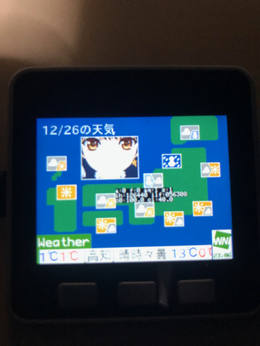

# M5S_WxBeacon2

https://user-images.githubusercontent.com/26270227/186464005-bfc6b1c4-3f5c-4e7f-b2bc-fb4b9d4b0df4.mp4

|天気予報|気象衛星ひまわり画像|
|---|---|
|| |


* WxBeacon2 から情報を取得し、ティッカーに表示、ポン子ちゃんアバターがアナウンスします。
* 気象庁の天気予報 JSON データを取得し、全国の天気を表示、ポン子ちゃんアバターがアナウンスします。
* **(Core2 のみ)** 気象衛星ひまわりの画像を取得し表示します。

## 概要
[株式会社ウェザーニューズ](https://ja.wikipedia.org/wiki/%E3%82%A6%E3%82%A7%E3%82%B6%E3%83%BC%E3%83%8B%E3%83%A5%E3%83%BC%E3%82%BA)(以下 WNI )による 24 時間お天気番組[ウェザーニュースLiVE](https://weathernews.jp/web910/) とリンクしたアプリケーション [ウェザーニュース](https://weathernews.jp/app/) では サンクスポイント 2000 pt以上取得すると[ウェザービーコン2](https://weathernews.jp/smart/wxbeacon2/)(以下 WxBeacon2 ) をゲットできます。(別途[有償購入](https://weathernews.jp/sorashop/)も可能)

|WxBeacon2|WEATHEROID TypeA Airi ちゃん|
|---|---|
||  |


M5Stack Basic, Gray, Core2 にて WxBeacon2 や気象庁からデータを取得し、
[AquesTalk ESP32](https://www.a-quest.com/products/aquestalk_esp32.html) で喋らせるアプリケーションです。  
どうせならウェザーニュースLiVE のマスコット、ポン子こと [WEATHEROID TypeA Airi](https://twitter.com/typea_airi) ちゃんに喋らせようという事で、アバターポン子ちゃんを作りました。


## 必要なもの

* M5Stack  
M5Stack Basic, Gray, Core2 のいずれか。

* Wi-Fi接続可能な機器  
ルータやモバイル Wi-Fi 等。

* (持っていれば) WxBeacon2  
実体は [OMRON 2JCIE-BL01](https://components.omron.com/jp-ja/products/sensors/2JCIE-BL) です。
WxBeacon2 でなく当該製品でも動作すると思われます(手元に無いので未確認)。

## コンパイル

### 依存ライブラリ
* [M5Unified](https://github.com/m5stack/M5Unified) 0.1.3 or later (depends on [M5GFX](https://github.com/m5stack/M5GFX) 0.1.3 or later)
* [NimBLE-Arduino](https://github.com/h2zero/NimBLE-Arduino) 1.4.0 or later
* [gob_json](https://github.com/GOB52/gob_json.git) 0.0.3 or later
* [gob_datetime](https://github.com/GOB52/gob_datetime.git) 0.1.1 or later
* [AquesTalk ESP32](https://www.a-quest.com/products/aquestalk_esp32.html) 2.21 or later  
AquesTalk ESP32 は [こちら](https://www.a-quest.com/download.html) よりダウンロード後、プロジェクトの lib フォルダ(無ければ作成)に展開してください。

### 画像リソース
初期状態ではダミーとして私が作った顔とロゴが使用されます。


**権利上の問題でポン子ちゃんの画像などは当リポジトリには含まれません。**  
ポン子ちゃんや他の画像を使いたい場合、自分で以下の条件を満たす画像を作成し、ソースファイルとして共にコンパイルする必要があります。  
ダミーリソースは全て weak symbol として定義されているので、ダミーリソースのソースファイルは削除する必要はありません。
自作した同名シンボルが存在すればそちらが使用されます。

#### 画像フォーマット
Basic,Gray での動作の都合上、メモリ使用料削減の為に 4bpp,1bpp を扱います。
[Windows Bitmap](https://ja.wikipedia.org/wiki/Windows_bitmap) の場合は Version 3 (BITMAPINFOHEADER.biSize == 40) format である必要があります。

**顔、閉じた口、開いた口は同じパレット配列でなければなりません。**  
16色 Bitmap のパレットの並び替えは、拙作 [reorder_palette.py](https://github.com/GOB52/bitmap_tools/blob/master/reorder_palette.py) が使用できます。

画像は作成の際の位置イメージです。

* 顔  
Windows bitmap 320 px x 240 px 4 bpp (16色)  パレット 0 番は透過色。口とパレット構成を合わせる為、顔にも透過色が必要。

* 閉じた口  
Windows bitmap 48 px x 32 px 4 bpp (16色) パレット 0 番は透過色。顔に透過色を用いて上書きされる。

* 開いた口  
Windows bitmap 48 px x 32 px 4 bpp (16色) パレット 0 番は透過色。顔に透過色を用いて上書きされる。


* WNI ロゴ  
Windows bitmap 32 px x 32 px 1 bpp (2色) パレット 0 番は透過色。ティッカーに透過色を用いて上書きされる。


#### ソースファイル化
全てのリソースについて行ってください。 ponko_face.bmp における例を示します。

```
xxd -i ponko_face.bmp ./src/res/ponko_face.cpp
```

xxd で C形式に変換します。出力場所は ./src/res が良いでしょう。
出力したソースを修正します。  
ヒープを空ける為、画像リソースは **PROGMEM として Flash の領域におきます**。

```cpp

#include <pgmspace.h> // PROGMEM を使う為
#include "resource.h"  // 宣言

//unsigned char ponko_face_bmp[] = {
PROGMEM const uint8_t ponko_face_bmp[] = {
  0x42, 0x4d, 0x76, 0x96, 0x00, 0x00, 0x00, 0x00, 0x00, 0x00, 0x76, 0x00,
  0x00, 0x00, 0x28, 0x00, 0x00, 0x00, 0x40, 0x01, 0x00, 0x00, 0xf0, 0x00,
.
.
.
};
// unsigned int ponko_face_bmp_len = 38518;
const size_t ponko_face_bmp_len = 38518;

```

詳しくは [各リソースの定義](src/res/resource.h) を参照してください。


### 動作設定

* タイムゾーン設定  
コンパイル時のオプション **M5S_WXBEACON2_TIMEZONE_LOCATION** (文字列) で指定します。  
デフォルトは **"Asia/Tokyo"** です。(M5Stack 内部では POSIX 表記を用いて設定されます)  

* データ自動取得間隔の設定  
コンパイル時のオプション **M5S_WXBEACON2_AUTO_REQUEST_INTERVAL_SEC** (数値)で指定します。  
デフォルトは 300 (5分間隔) です。  
(Core2 ではひまわりの画像取得のインターバルとなります)

* ランダムお喋り間隔の設定  
コンパイル時のオプション **M5S_WXBEACON2_AUTO_TALK_INTERVAL_SEC** (数値)で指定します。  
デフォルトは 60 (1分間隔) です。


### Wi-Fi SSID password

指定したタイムゾーンでの時刻取得の為、起動時に Wi-Fi 接続で NTP サーバーへの接続を行います。  
(時刻の表示並びに、 WxBeacon2 のモードを出荷時に戻す際に、蓄積データの基準時刻を書き込む必要がある為)  
前もって接続する Wi-Fi の SSID とパスワードをハードに書き込む必要があります。(WiFi.begin() を引数なしで呼ぶと保存されている情報を元に接続します)  
SmartConfig 等を利用して SSID とパスワード書き込むか、 WiFi.begin(ssid, password); として一旦接続させるかして、ハードに情報を保存してください。  
@tnkmasayuki さんによる記事 [Lang-ship](https://lang-ship.com/blog/work/esp32-wi-fi-setting/) が参考になるでしょう。

### AquesTalk ESP32 ライセンス
評価版では諸々の制限があります。ライセンスを取得した場合は、 src/aq_talk.cpp のライセンス部分を書き換えてください。

```cpp
bool initialize(const UBaseType_t priority, const BaseType_t core, aq_talk_callback f)
{
    if(!task_handle)
    {
        xTaskCreateUniversal(talk_task, "aq_talk_task", 4 * 1024, nullptr, priority, &task_handle, core);
        callbackOnEnd = f;
        return task_handle
                && CAqTkPicoF_Init(workbuf, LEN_FRAME, "XXX-XXX-XXX") == 0; // ここにライセンスコード
    }
    return true;
}
```

## 動作

WxBeacon2 は通常(出荷時状態)、計測データを内部に蓄積しますが、このアプリケーションでは蓄積モードではなく、ブロードキャストモードを利用します。後述の操作方法(\*1)より、ブロードキャストモードに変更する必要があります。  
**なおモードを変更した場合、蓄積したデータは全て失われる点、ウェザーニュースアプリとの連携ができなくなる点には注意です。**  
**後述の操作方法(\*2)によって出荷時に状態を戻し、再びウェザーニュースアプリとの連携を取ることができるようになります。**
モードがブロードキャストモードではない場合は、ティッカーが紫色となり、ティッカーにその旨表示されます。。  
ブロードキャストモードであれば、起動時にデータを取得、ティッカーに表示してポン子ちゃんが喋ります。その際のティッカーの色は WBGT (熱中症危険度) のレベルに応じて青、黄、赤のいずれかの色となります。


## 操作方法

|ボタン| 長押し(1.5秒以上) | クリック |
|---|---|---|
|A | 全国の天気を取得して喋る [Wi-Fi 通信] | WxBeacon2のデータを取得して喋る[BLE 通信]|
|B | (\*2)WxBeacon2 を出荷時の状態へ戻す [BLE 通信] | |
|C | (\*1)WxBeacon2 をブロードキャストモードに変更する [BLE 通信] | ティッカー表示の ON/OFF |

各通信は排他的に動作するので、通信動作させるボタンは通信中は動作しません。  
通信中は画面左下に Wi-Fi か BT マークが点滅表示されています。  


C 長押しでブロードキャストモードに上手くならなかった場合は、 B 長押しで出荷時に戻して再度試してください。

## Zenn の記事
- WxBeacon2 と M5Stack との NumBLE によるやり取り  
こちらで[記事](https://zenn.dev/gob/articles/wxbeacon2_000_bbc2e4106f701c)にしました。
- 気象庁天気予報 JSON と ひまわり画像に関して  
こちらで[記事](https://zenn.dev/gob/articles/wxbeacon2_001_961ea4d226fc24)にしました。


## 謝辞
* 各ライブラリの作成者関係者の方々、助言や示唆を頂いた方々には毎度大変お世話になっております。  
* 気象庁 JSON 、気象衛星ひまわり画像取得に関しての先人の皆様方の情報を参考にしました。  
* 毎日楽しい番組を送ってくださる WNI のスタッフ、[気象予報士、キャスター](https://weathernews.jp/wnl/caster/index.html)他の皆様、作業中ラジオ的に楽しんでおります。  
* 元祖 Vtuber ポン子ちゃんを生み出した皆様、マネージャーの[山岸キャスター](https://twitter.com/airin0609)、木曜日の深夜がいつも楽しみです。  


## 権利、規約等

###  気象庁 トゥルーカラー再現画像の利用規約に基づく表記

#### 日本語
>(1) トゥルーカラー再現画像の説明  
>トゥルーカラー再現画像は、ひまわり8号・9号の可視3バンド（バンド1、2、3）、近赤外1バンド（バンド4）及び赤外1バンド（バンド13）を利用し、人間の目で見たような色を再現した衛星画像です。本画像は、衛星によって観測された画像を人間の目で見たように再現する手法（参考文献[1]）によって作成されています。この色の再現過程において緑色を調節するために、Millerらによる手法（参考文献[2]）の応用として、バンド2、3、4が使用されています。また、画像をより鮮明にするために、大気分子により太陽光が散乱される影響を除去するための手法（レイリー散乱補正）（参考文献[2]）が利用されています。  
>
>(2) 謝辞  
>トゥルーカラー再現画像は、気象庁気象衛星センターと米国海洋大気庁衛星部門GOES-Rアルゴリズムワーキンググループ画像チーム（NOAA/NESDIS/STAR GOES-R Algorithm Working Group imagery team）との協力により開発されました。また、レイリー散乱補正のためのソフトウェアは、NOAA/NESDISとコロラド州立大学との共同研究施設（Cooperative Institute for Research in the Atmosphere: CIRA）から気象庁気象衛星センターに提供されました。関係機関に感謝いたします。  
>
>(3) 参考文献  
>[1] Murata, H., K. Saitoh, Y. Sumida, 2018: True color imagery rendering for Himawari-8 with a color reproduction approach based on the CIE XYZ color system. J. Meteor. Soc. Japan., doi: 10.2151/jmsj.2018-049.  
>[2] Miller, S., T. Schmit, C. Seaman, D. Lindsey, M. Gunshor, R. Kohrs, Y. Sumida, and D. Hillger, 2016: A Sight for Sore Eyes - The Return of True Color to Geostationary Satellites. Bull. Amer. Meteor. Soc. doi: 10.1175/BAMS-D-15-00154.1  

#### English
>1) True Color Reproduction imagery  
>True Color Reproduction (TCR) technology enables the display of earth images taken from space in a way that is familiar to the human eye. The imagery consists of data from three visible bands (Band 1, 2 and 3), one near-infrared band (Band 4) and one infrared band (Band 13). To reproduce colors as seen by the human eye, RGB signals observed by AHI are converted into CIE XYZ values and reconverted into RGB signals for output devices compliant with sRGB (an international standard for RGB color space) (Murata et al., 2018). In this process, as an alternative to the bi-spectral hybrid green method outlined by Miller et al. (2016), the green band is optimally adjusted using Band 2, 3 and 4. To make the imagery more vivid, atmospheric correction (Rayleigh correction, Miller et al., 2016) is also applied to AHI Bands 1-4. Software for this purpose was provided by the Cooperative Institute for Research in the Atmosphere (CIRA) established by NOAA/NESDIS and Colorado State University in United States of America.  
>
>2) Acknowledgement  
>The imagery was developed on the basis of collaboration between the JMA Meteorological Satellite Center and the NOAA/NESDIS/STAR GOES-R Algorithm Working Group imagery team. We would like to acknowledge them for the collaboration and their permission to use the software.  
>
>3) Reference  
>Murata, H., K. Saitoh, Y. Sumida, 2018: True color imagery rendering for Himawari-8 with a color reproduction approach based on the CIE XYZ color system. J. Meteor. Soc. Japan. doi: 10.2151/jmsj. 2018-049  
>Miller, S., T. Schmit, C. Seaman, D. Lindsey, M. Gunshor, R. Kohrs, Y. Sumida, and D. Hillger, 2016: A Sight for Sore Eyes - The Return of True Color to Geostationary Satellites. Bull. Amer. Meteor. Soc. doi: 10.1175/BAMS-D-15-00154.1  

